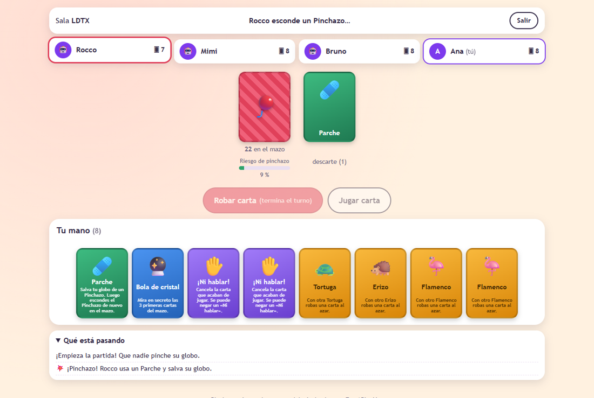
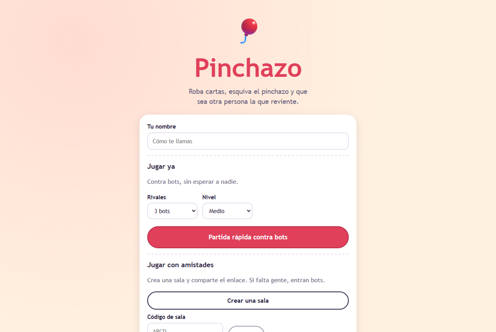
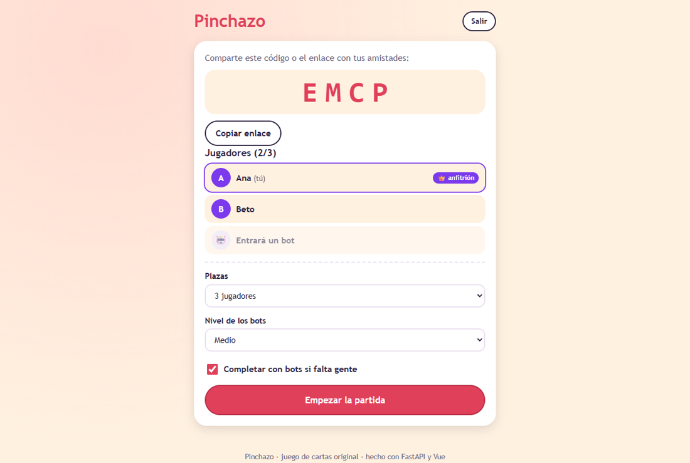
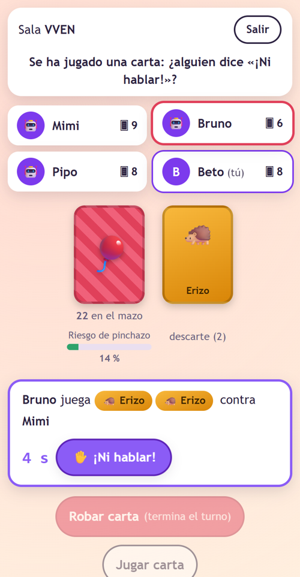

# 🎈 Pinchazo

Un juego de cartas de globos para jugar en el navegador, **con amistades o contra bots**. Si falta gente en la sala, entran bots a ocupar las plazas.

> Roba cartas, esquiva el pinchazo y que sea otra persona la que reviente.

<p align="center">
  
</p>
<p align="center">
  
  
  
</p>

## Cómo se juega

Cada persona tiene un globo. En tu turno puedes jugar las cartas que quieras y **debes terminar robando una carta** del mazo.

- Si robas un **💥 Pinchazo** y tienes un **🩹 Parche**, lo gastas y **escondes el Pinchazo** donde quieras del mazo.
- Si no tienes Parche, **tu globo revienta** y quedas fuera.
- **Gana la última persona** con el globo entero.

| Carta | Qué hace |
|---|---|
| 💨 Esquivar | Terminas el turno sin robar |
| 🥧 Tartazo | No robas y la siguiente persona juega dos turnos seguidos (se acumula) |
| 🔮 Bola de cristal | Miras en secreto las 3 primeras cartas del mazo |
| 🌀 Remolino | Barajas el mazo |
| 🤲 Favor | Pides una carta: la otra persona elige cuál darte |
| ✋ ¡Ni hablar! | Cancela la carta que acaban de jugar. Se puede negar otro «¡Ni hablar!» |
| 🐙🦜🐢🦔🦩 Mascotas | Con dos iguales le robas una carta al azar a quien elijas |

Tras cada carta jugada hay una **ventana de unos segundos** para responder «¡Ni hablar!».
El tablero muestra el **riesgo de pinchazo** (los Pinchazos del mazo siempre son uno menos que las personas vivas).

Se juega de **2 a 5 personas**. Quien no responde a tiempo pasa al **piloto automático**, y quien se desconecta puede volver a su asiento (recargar la página no pierde la partida).

## Bots

Hay tres niveles: **fácil**, **medio** (el que viene por defecto) y **difícil**. Los bots no hacen trampas: deciden con lo que cualquier persona sabría (su mano, cuántos Pinchazos quedan y lo que han visto con la Bola de cristal).

Un bot de nivel medio calcula el riesgo de robar, se protege cuando sube, usa parejas y favores, responde a veces con «¡Ni hablar!» y comete algún despiste, como una persona. Simulando 600 partidas de 4 jugadores:

| Un bot… | …contra tres bots… | Gana |
|---|---|---|
| medio | fáciles | 36 % |
| difícil | fáciles | 37,5 % |
| difícil | medios | 28 % |
| fácil | medios | 15 % |

(Con 4 jugadores, el azar puro daría un 25 %. El juego tiene mucha suerte, así que las diferencias son moderadas.)

## Cómo funciona por dentro

```
app/
├── main.py            API REST, WebSocket y la web (FastAPI)
├── salas.py           Salas, asientos, temporizadores, bots que completan plazas, reconexión
├── juego/
│   ├── cartas.py      Catálogo de cartas (nombres, textos, cantidades)
│   ├── motor.py       Las reglas, sin nada de web: recibe acciones y cambia el estado
│   └── bots.py        Decisiones de los bots por nivel
└── static/            La interfaz (Vue 3 sin paso de compilación, HTML y CSS)
tests/                 67 pruebas: reglas, bots, servidor y partidas reales por WebSocket
```

- **El servidor decide todo.** El navegador solo envía acciones («robar», «jugar»…) y recibe lo que esa persona puede ver. Nadie ve las cartas de las demás ni el orden del mazo.
- **El motor es puro Python** y se prueba sin abrir el navegador, igual que el motor de [Sudoku](https://github.com/MFloresr/sudoku).
- **Tiempo real con WebSockets.** Cada sala tiene un «conductor» asíncrono que hace avanzar la partida: pausa a los bots para que se vea lo que hacen, espera a las personas con tiempo límite y abre la ventana de «¡Ni hablar!».
- **La llave del asiento** (token) se envía como primer mensaje del WebSocket y no en la dirección, para que no aparezca en los registros del servidor.
- Validación de datos con **Pydantic**, límite de tamaño y de ritmo de mensajes, y nombres escapados por Vue (no se usa `v-html`).

## Probarlo en tu ordenador

```bash
python -m venv .venv
.venv\Scripts\activate            # en Linux/Mac: source .venv/bin/activate
pip install -r requirements-dev.txt
uvicorn app.main:app --reload     # http://localhost:8000
pytest                            # 67 pruebas
```

Para jugar con otra persona en tu red, abre la sala y comparte el enlace con tu IP local (`uvicorn app.main:app --host 0.0.0.0`).

## Desplegarlo en Render

El repositorio ya incluye `render.yaml`, así que se despliega como *Blueprint*:

1. Sube el repositorio a GitHub.
2. En [Render](https://dashboard.render.com): **New → Blueprint**, elige este repositorio y pulsa **Apply**.
3. Cuando termine, Render te da una dirección `https://pinchazo-xxxx.onrender.com`. Ya se puede jugar.

(También se puede crear un *Web Service* a mano con estos datos: *Runtime* Python · *Build* `pip install -r requirements.txt` · *Start* `uvicorn app.main:app --host 0.0.0.0 --port $PORT` · *Health check* `/salud`.)

**Cosas que conviene saber:**

- **Una sola instancia.** Las salas viven en memoria; si escalas a varias instancias, cada una tendría sus propias salas. Para una instancia basta de sobra.
- **Plan gratuito:** Render lo **duerme tras 15 minutos sin tráfico** y tarda cerca de un minuto en despertar. Al dormirse se pierden las salas abiertas. Los mensajes del WebSocket cuentan como tráfico, así que una partida en curso no se duerme.
- **Reinicios:** cada despliegue reinicia el servidor y termina las partidas en curso.
- Versión de Python: el archivo `.python-version` pide la 3.13.

## Sobre el juego

Pinchazo es un juego **original**: nombres, textos y dibujos son propios (emojis y CSS). Las reglas generales de los juegos de cartas de eliminación no están protegidas, pero los nombres, el arte y los textos de otros juegos sí, y aquí no se usa ninguno.

## Licencia

MIT. Incluye [Vue](https://vuejs.org) 3 (MIT) en `app/static/vendor/`.
